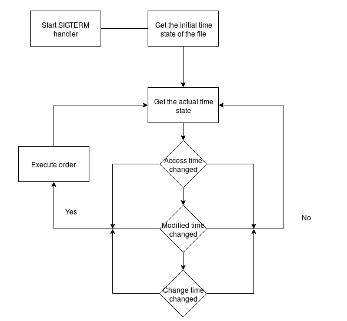
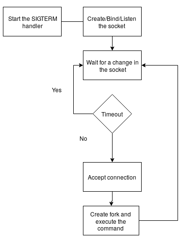

<h1 class="title">Manual Systemd Unit Execution</h1>
<h2 class="subtitle">Análisis, ejecución y creación de las Systemd Unit</h2>

Bruno Mondelo &mdash; 2017-05-23

---

<h2 class="section-title">Índice</h2>
<ul class="index-list">
  <li class="index-purple">¿Qué es una <strong>Unit</strong>?</li>
  <li class="index-purple">¿Qué <strong>Unit</strong> hay?</li>
  <li class="index-purple">¿Se pueden crear nuevas Unit? ¿<strong>Como</strong>?</li>
  <li class="index-purple">Realización <strong>manual</strong> de las Unit</li>
  <li class="index-purple">Conclusión</li>
</ul>

---

<h2 class="section-title">¿Qué es una Unit?</h2>
<ul class="index-list">
  <li class="index-blue">Contenido</li>
  <li class="index-blue">¿Dónde están?</li>
</ul>

---

<h2 class="section-title">¿Qué Unit hay?</h2>
<ul class="index-list">
  <li class="index-orange">Mount</li>
  <li class="index-orange">Automount</li>
  <li class="index-orange">Swap</li>
  <li class="index-orange">Device</li>
  <li class="index-orange">Service</li>
  <li class="index-orange">Socket</li>
  <li class="index-orange">Path</li>
  <li class="index-orange">Timer</li>
  <li class="index-orange">Scope</li>
  <li class="index-orange">Slice</li>
  <li class="index-orange">Snapshot</li>
  <li class="index-orange">Target</li>
</ul>

---

<h3 class="section-title">Mount</h3>
<ul class="index-list">
  <li class="index-green">Información de un <strong>mount point</strong></li>
  <li class="index-green"><strong>FSTAB</strong> Vs. Systemd Mount</li>
  <li class="index-green">Nombre especifico</li>
</ul>

---

<h3 class="section-title">Automount</h3>
<ul class="index-list">
  <li class="index-green">Monta automáticamente un <strong>mount point</strong></li>
  <li class="index-green"><strong>Requiere</strong> de una Unit Mount</li>
  <li class="index-green">Nombre especifico</li>
</ul>

---

<h3 class="section-title">Swap</h3>
<ul class="index-list">
  <li class="index-green">Dispositivos <strong>Swap</strong></li>
  <li class="index-green"><strong>Paginación</strong> controlada por Systemd</li>
  <li class="index-green"><strong>FSTAB</strong> Vs. Systemd Swap</li>
  <li class="index-green">Nombre especifico</li>
</ul>

---

<h3 class="section-title">Device</h3>
<ul class="index-list">
  <li class="index-green">Dispositivo marcado por <strong>udev</strong></li>
</ul>

---

<h3 class="section-title">Service</h3>
<ul class="index-list">
  <li class="index-gold">Procesos</li>
</ul>

---

<h3 class="section-title">Socket</h3>
<ul class="index-list">
  <li class="index-gold">Activación de un <strong>Service</strong> basado en socket</li>
  <li class="index-gold">IPC (Inter-Process Comunication)</li>
  <li class="index-gold">Network Sockets</li>
  <li class="index-gold">FIFO</li>
</ul>

---

<h3 class="section-title">Path</h3>
<ul class="index-list">
  <li class="index-gold">Activación de una <strong>Unit</strong> basado en un path</li>
  <li class="index-gold">Nombre específico</li>
</ul>

---

<h3 class="section-title">Timer</h3>
<ul class="index-list">
  <li class="index-gold">Activación de una <strong>Unit</strong> basado en tiempo</li>
  <li class="index-gold">Nombre específico</li>
</ul>

---

<h3 class="section-title">Scope</h3>
<ul class="index-list">
  <li class="index-red">Configura un grupo de procesos</li>
  <li class="index-red">Controla los <strong>recursos</strong></li>
  <li class="index-red">No se configuran. <strong>Dinámicamente</strong> se crean</li>
</ul>

---

<h3 class="section-title">Slice</h3>
<ul class="index-list">
  <li class="index-red">Controla de manera <strong>jerárquica</strong> un grupo de procesos</li>
  <li class="index-red">Permite configurar los recursos</li>
</ul>

---

<h3 class="section-title">Snapshot</h3>
<ul class="index-list">
  <li class="index-turqoise">Guarda el <strong>status</strong> de Systemd</li>
  <li class="index-turqoise">Son volátiles</li>
  <li class="index-turqoise">Permiten hacer <strong>rollback</strong></li>
</ul>

---

<h3 class="section-title">Target</h3>
<ul class="index-list">
  <li class="index-turqoise">Grupo de <strong>Unit</strong></li>
  <li class="index-turqoise">Permiten cambiar de Unit</li>
  <li class="index-turqoise"><strong>SysVinit</strong> traducción</li>
</ul>

---

<h2 class="section-title">Realización manual de las Unit</h2>
<ul class="index-list">
  <li class="index-fuchsia">Timer</li>
  <li class="index-fuchsia">Path</li>
  <li class="index-fuchsia">Socket</li>
</ul>

---

<h3 class="section-title">Timer</h3>
<ul class="index-list">
  <li class="index-gold">Crond</li>
</ul>

---

<h3 class="section-title">Path</h3>

---

<h3 class="section-title">Socket</h3>

---

<h2 class="section-title">Conclusión</h2>

---

